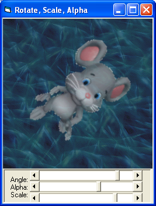



## A function for Antialiased Rotation with transparent color and alpha blending

### Description

Rotate image

1 function for to cover your picture rotation needs (compatible with XP, CE, ME, NT, 98...).

Written from scratch standalone function

similar to TranspBlt, BitBlt, StretchBlt,AlphaBlend

Features:

Antialiased rotation

Supports Transparent color

Alphablending

Scaling

Choose pivot pixel

Extremely quick *Please comment &amp; vote*
 
### More Info
 

             |
---                |---
**Submitted On**   |2005-05-11 15:58:02
**By**             |[Lefteris Eleftheriades](https://github.com/Planet-Source-Code/PSCIndex/blob/master/ByAuthor/lefteris-eleftheriades.md)
**Level**          |Intermediate
**User Rating**    |4.9 (94 globes from 19 users)
**Compatibility**  |VB 5\.0, VB 6\.0
**Category**       |[Graphics](https://github.com/Planet-Source-Code/PSCIndex/blob/master/ByCategory/graphics__1-46.md)
**World**          |[Visual Basic](https://github.com/Planet-Source-Code/PSCIndex/blob/master/ByWorld/visual-basic.md)
**Archive File**   |[A\_function1887025112005\.zip](https://github.com/Planet-Source-Code/lefteris-eleftheriades-a-function-for-antialiased-rotation-with-transparent-color-and-alph__1-60476/archive/master.zip)

